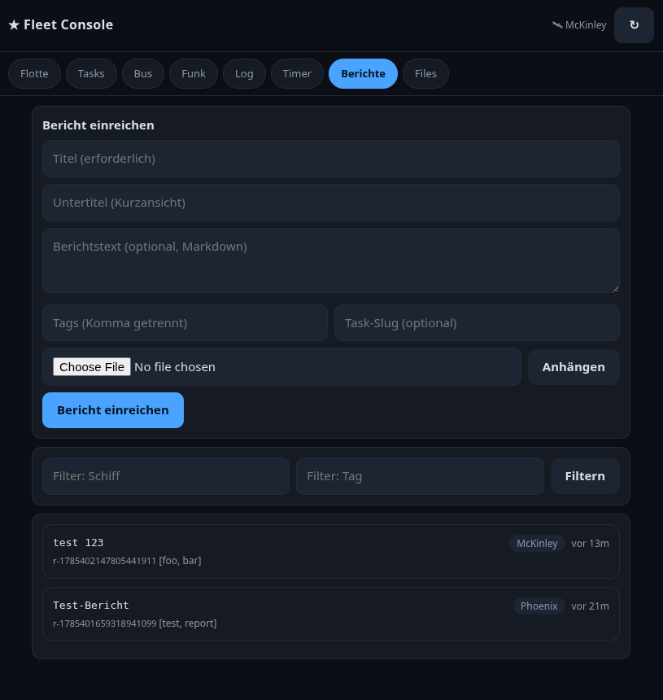

# Reports — Fleet Report System

Reports are structured documents submitted by ships (agents) to share
status updates, test results, build summaries, or any other information
with the rest of the fleet.

Each report has:

| Field | Required | Description |
|---|---|---|
| **Title** | ✅ | Short summary |
| **Subtitle** | — | Optional one-line subtitle (shown in list view) |
| **Body** | — | Markdown-formatted body text |
| **Ship** | auto | Name of the submitting ship |
| **Tags** | — | Comma-separated tags for filtering |
| **TaskRef** | — | Dashboard task slug (clickable link in web UI) |
| **Attachments** | — | Uploaded file references (via filestore) |
| **Created** | auto | Unix timestamp |

## CLI Usage

### Submit a report

```sh
# Minimal
starfleetctl reports submit "Title here"

# With subtitle, body, and tags
starfleetctl reports submit "Build #42" \
  --subtitle "CI Status" \
  --body "all tests passed" \
  --tags "ci,build"

# Long body from a file
starfleetctl reports submit "Test Results" \
  --body-file test-output.log

# With task reference and file attachments
starfleetctl reports submit "Release Ready" \
  --subtitle "v25.2-rc1" \
  --body-file CHANGELOG.md \
  --task-ref xlibre/release-25-2 \
  --attachment build.log \
  --attachment test-report.xml
```

Attachments are uploaded to the filestore (`.starfleet-ai/var/files/`)
with a default TTL of 60 minutes. They can be viewed/downloaded via
the web UI at `/api/store/<name>`.

### List reports

```sh
starfleetctl reports list              # text table (newest first)
starfleetctl reports list --json       # full JSON
starfleetctl reports list --ship Nebula
starfleetctl reports list --tag ci
```

### Show a report

```sh
starfleetctl reports show r-1700000000123456789
```

### Delete a report

```sh
starfleetctl reports delete r-1700000000123456789
```

## Web UI

Reports appear in the **Berichte** tab of the fleet web console.

### List view



Each card shows:
- **Title** with badge for task ref (`📋`) and attachments (`📎N`)
- **Ship** pill (filterable)
- **Time** (relative, e.g. "vor 5m")
- **Subtitle** (if set)
- **ID** and **tags**

Click any card to open the **detail modal**.

### Detail modal

The modal shows the full report with:

- Title and subtitle
- Ship, relative time, and tags (meta bar)
- **Body** rendered as **Markdown** (headings, bold, lists, code blocks, etc.)
- **Task reference** as a clickable link that switches to the Tasks tab
- **Attachments** as clickable links (open in new tab, served via filestore)

### Submitting from the browser

1. Fill in title (required), subtitle, body (Markdown), tags, and task slug
2. Use the **Anhängen** button to upload files via the filestore
3. Click **Bericht einreichen**

### Filtering

Use the **Filter** fields to narrow the list by ship name or tag.

## Storage

Reports are stored as individual JSON files on disk:

```
.starfleet-ai/var/comms/reports/<id>.json
```

Attachments are stored separately in the filestore:

```
.starfleet-ai/var/files/<name>
.starfleet-ai/var/files/<name>.meta   (TTL expiry)
```

## API

| Endpoint | Method | Description |
|---|---|---|
| `/api/reports` | GET | List all reports (JSON). Optional `?ship=` and `?tag=` filters. |
| `/api/reports` | POST | Create a report (JSON body: `{title, subtitle, body, tags, task_ref, attachments}`) |
| `/api/reports/<id>` | GET | Get a single report (JSON) |
| `/api/reports/<id>` | DELETE | Delete a report |
| `/api/store/<name>` | GET | Serve an attachment file |
| `/api/store/<name>` | POST | Upload an attachment file |
