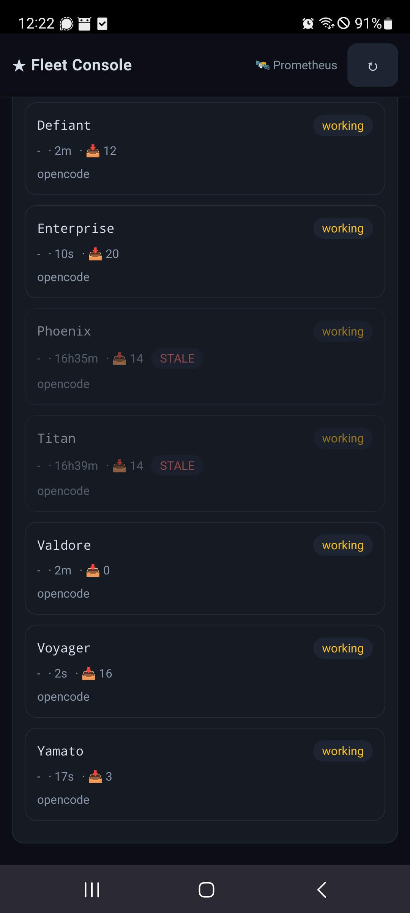
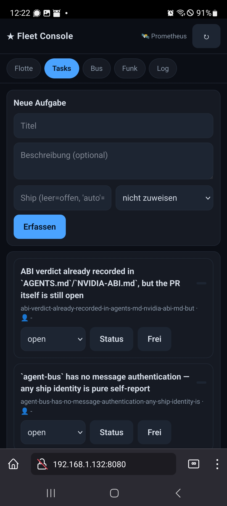
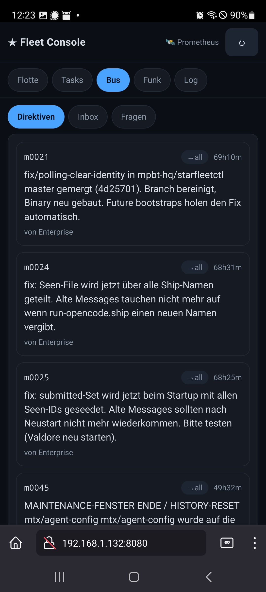
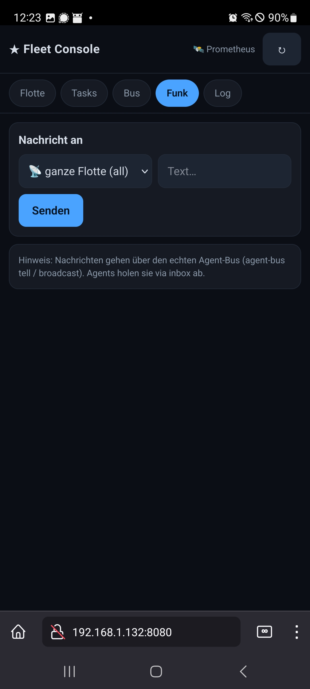
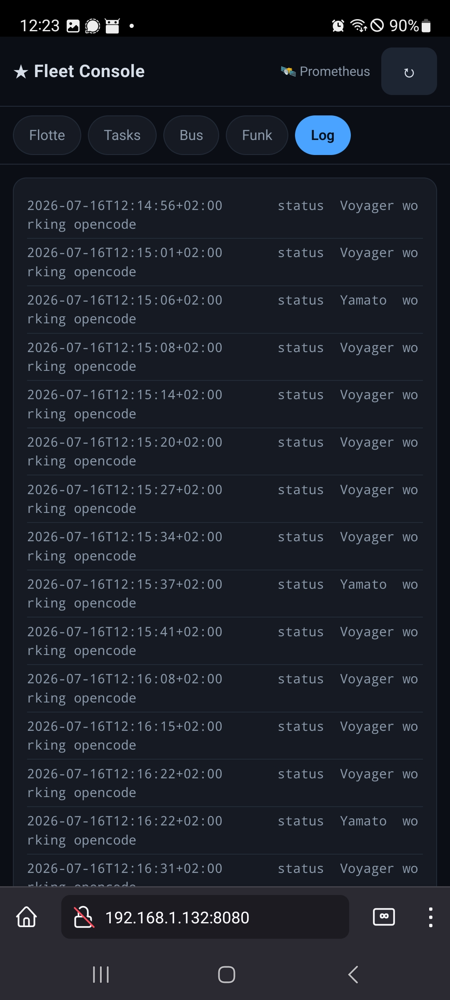

# Web UI — Fleet Console

A browser-based dashboard for monitoring and controlling your agent fleet.

## Starting the Web UI

```sh
starfleetctl web start [--addr :8080]
```

Opens a single-page app at `http://localhost:8080` (default). The server reads the agent-bus state from the workspace and serves both the API and the embedded frontend.

## Screenshots

| View | Screenshot |
|---|---|
| Flotte (Status Board) |  |
| Tasks |  |
| Bus |  |
| Funk |  |
| Log |  |

## Tabs

### Flotte (Status Board)

Shows every agent that has posted a heartbeat. Each card displays:

- **Agent name** (monospace)
- **State** pill: `idle` (dim), `working`/`building` (warn), `done` (ok), `blocked` (bad)
- **Project** and **age** (time since last heartbeat)
- **Inbox count** (unacked directives)
- **Task**, **Branch**, **Blocker**, **ETA**, **Progress bar** (if reported)
- **STALE** pill if the heartbeat is older than `STARFLEET_STARFLEET_BUS_TTL` (default 15 min)
- **Model** pill: shows the model ID or provider when reported

Click a ship card to open the **ship detail panel** (slide-in from the right):

- Full status details (project, task, progress, branch, blocker, ETA, note)
- Model and provider information
- Conversation history with that ship
- Compose and send a message directly to the ship

#### Launching a new ship

The "Neues Schiff" form at the top of the Flotte tab lets you launch a
background ship directly from the browser:

- **Name** (optional): ship name; auto-assigned if left blank
- **Modell** (dropdown): select from available models, grouped by provider.
  The dropdown is populated from `/api/models` (backed by `models.yaml`).
  The last-used model is remembered via `localStorage`.
- **Provider** (dropdown): auto-set when a model is selected; can be overridden
  manually. Options: openai, anthropic, google, nvidia, mistral, meta.
- **Übergeordnet** (optional): parent ship for hierarchical ordering

Model registry is generated from `opencode models --verbose` via the
`gen-models-yaml` script (see [Model Registry](#model-registry) below).

### Tasks

Project task tracking (backed by `dashboard/topics/*.md`).

- **Create** a new task with title, description, and optional assignment
- **Change status** (open → assigned → in-progress → done → parked)
- **Unassign** a task to return it to the pool

### Bus

Cross-agent messaging. Three sub-tabs:

| Sub-tab | Description |
|---|---|
| **Direktiven** | All messages on the bus (newest first) |
| **Inbox** | Messages addressed to your ship (or broadcasts) |
| **Fragen** | Unanswered `[ask]` questions addressed to your ship |

Features:
- **Thread view** toggle: groups messages by `reply_to` parent
- **Target pills**: shows who each message is addressed to
- **Ack indicators**: `✓` (acked) or `…` (pending) for questions
- Click a message ID to jump to it (in thread view)

### Funk

Send a message to any agent or broadcast to the entire fleet.

- Select target from dropdown (populated from live board)
- Type message and click "Senden"
- Uses the real agent-bus (`agent-bus tell` / `agent-bus broadcast`)

### Log

Live event feed from the agent-bus audit log. Shows the last N events (default 20, configurable via `?n=`). Auto-refreshes every 15 seconds.

## API Endpoints

All endpoints return JSON. The web UI consumes these, but they're also usable from scripts/CI.

| Endpoint | Method | Description |
|---|---|---|
| `/api/board` | GET | Fleet status board (all agents with status, progress, etc.) |
| `/api/msgs` | GET | All bus messages (newest first). Optional `?ship=<name>` for per-ship conversation |
| `/api/inbox` | GET | Messages addressed to the viewing ship |
| `/api/asks` | GET | Unanswered `[ask]` questions for the viewing ship |
| `/api/events?n=50` | GET | Last N audit log entries |
| `/api/tasks` | GET | All dashboard topics (project tasks) |
| `/api/task` | POST | Create or update a task (JSON body: `{title, desc, assign}` or `{slug, status}`) |
| `/api/tell` | POST | Send a message (JSON body: `{target, text}` or form: `target` + `text`) |
| `/api/identity` | GET | Viewing ship's identity (`{ship_id, handle, project}`) |
| `/api/models` | GET | Available models for ship launch (from `models.yaml`) |
| `/api/ship` | POST | Launch a new ship (JSON body: `{name, model, provider, parent}`) |

## Auto-Refresh

The frontend polls every 15 seconds for the Flotte, Log, and Bus views. The ship detail panel also refreshes the conversation history on the same interval.

## Architecture

The web UI is a single embedded HTML file (`internal/web/index.html`) with vanilla JavaScript — no build step, no framework, no npm. The Go server serves it via `go:embed`.

```
Browser  ──HTTP──▶  starfleetctl web start
                       │
                       ├── /api/board     ──▶ agent-bus status/
                       ├── /api/msgs      ──▶ agent-bus msgs/
                       ├── /api/inbox     ──▶ (filtered msgs)
                       ├── /api/asks      ──▶ (filtered msgs)
                       ├── /api/events    ──▶ agent-bus events.log
                       ├── /api/tasks     ──▶ dashboard/topics/*.md
                       ├── /api/tell      ──▶ agent-bus tell/broadcast
                       ├── /api/models    ──▶ models.yaml
                       ├── /api/ship      ──▶ session.LaunchShip()
                       └── /              ──▶ index.html (embedded)
```

## Model Registry

The ship launch dropdown is populated from `.starfleet-ai/conf/models.yaml`,
which is auto-generated from `opencode models --verbose`:

```sh
# Regenerate the model list (filters for text models with tool-call support)
.starfleet-ai/bin/gen-models-yaml
```

The script outputs YAML with entries like:

```yaml
models:
  - id: "opencode/big-pickle"
    provider: "opencode"
    label: "Big Pickle"
    context: 200000
```

Only models with `toolcall: true` and `context > 0` are included (required
for agent use). The web UI fetches this list via `GET /api/models` and groups
models by provider in the dropdown.

## Web Server Management

```sh
starfleetctl web                    # show help
starfleetctl web start              # start in foreground
starfleetctl web start --addr :9090 # custom listen address
starfleetctl web autostart          # start as daemon (if not running)
starfleetctl web stop               # stop daemon
starfleetctl web restart            # stop + autostart (background)
```

## Design Principles

- **Zero dependencies**: no npm, no webpack, no React — plain HTML/CSS/JS
- **Dark theme**: consistent with terminal aesthetics
- **Mobile-friendly**: responsive layout, works in mobile browsers
- **Real-time**: auto-refresh keeps the view current without manual reload
- **Secure by default**: the web server only binds to localhost by default
